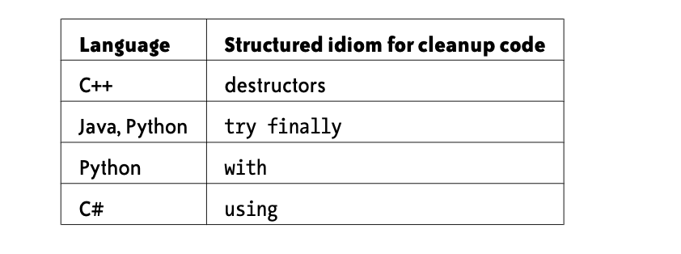
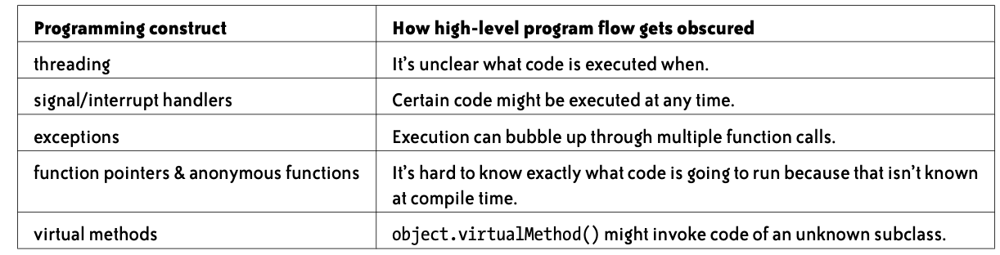

# Chapter 7: Making Control Flow Easy to Read


Nếu mã không có điều kiện, vòng lặp hoặc bất kỳ luồng điều khiển nào khác, thì nó sẽ rất dễ đọc. Các bước nhảy và nhánh là nội dung khó, nơi mã có thể gây nhầm lẫn nhanh chóng. Chương này là về cách tạo luồng điều khiển trong mã của bạn dễ đọc.

> **KEY IDEA**
>
> **Thực hiện tất cả các điều kiện, vòng lặp và các thay đổi khác để kiểm soát luồng "tự nhiên" nhất có thể — được viết theo cách không khiến người đọc dừng lại và đọc lại mã của bạn.**

## The Order of Arguments in Conditionals

Đoạn mã nào trong số hai đoạn mã này dễ đọc hơn:
```ruby
if (length >= 10)
```
or
```ruby
if (10 <= length)
```
Đối với hầu hết các lập trình viên, cái đầu tiên dễ đọc hơn nhiều. Nhưng còn hai điều kiện tiếp theo:
```ruby
while (bytes_received < bytes_expected)
```
or
```ruby
while (bytes_expected > bytes_received)
```
Một lần nữa, phiên bản đầu tiên dễ đọc hơn. Nhưng tại sao? Quy tắc chung là gì? Làm cách nào để bạn quyết định viết a < b hay b > a tốt hơn?

Dưới đây là một nguyên tắc mà chúng tôi thấy hữu ích:

| **Phía tay trái**      | **Phía tay phải** |
| -----------            | -----------       |
| The expression “being interrogated,” whose value is more in flux | The expression being compared against, whose value is more constant.


Hướng dẫn này phù hợp với cách sử dụng tiếng Anh — khá tự nhiên khi nói, “nếu bạn kiếm được ít nhất $ 100K / năm” hoặc “nếu bạn từ 18 tuổi trở lên”. Không tự nhiên khi nói, "nếu 18 tuổi nhỏ hơn hoặc bằng tuổi của bạn."

Điều này giải thích tại sao while (bytes_receive < bytes_eosystem) dễ đọc hơn. bytes_receive là giá trị mà chúng tôi đang kiểm tra và nó đang tăng lên khi vòng lặp thực thi. bytes_eosystem là giá trị "ổn định" hơn được dùng để so sánh

## “YODA NOTATION”: STILL USEFUL?
Trong một số ngôn ngữ (bao gồm C và C ++, nhưng không phải Java), việc dùng phép gán bên trong điều kiện if là hợp lệ:
```c++
if (obj = NULL) ...
```
Nhiều khả năng đây là một lỗi và người lập trình thực sự muốn nói:
```c++
if (obj == NULL) ...
```
Để ngăn chặn các lỗi như thế này, nhiều lập trình viên chuyển đổi thứ tự của các đối số:
```c++
if (NULL == obj) ...
```

Bằng cách này, if == vô tình được viết thành =, biểu thức if (NULL = obj) thậm chí sẽ không được biên dịch.

Thật không may, việc chuyển đổi thứ tự làm cho mã hơi mất tự nhiên khi đọc. (Như Yoda sẽ nói, "Not if anything to say about it I have”) Rất may, các trình biên dịch hiện đại cảnh báo chống lại mã như if (obj = NULL), vì vậy “Kí hiệu Yoda” đang trở thành dĩ vãng.

## The Order of if/else Blocks


Khi viết câu lệnh if / else, bạn thường có quyền tự do hoán đổi thứ tự của các khối. Ví dụ, bạn có thể viết nó như sau:

```ruby
if (a == b) {
  // Case One ...
} else {
  // Case Two ...
}
```
hoặc:

```ruby
if (a != b) {
  // Case Two ...
} else {
  // Case One ...
}
```
Có thể bạn đã không nghĩ nhiều về điều này trước đây, nhưng trong một số trường hợp, có những lý do chính đáng để bạn thích cách này hơn cách kia:
* Ưu tiên xử lý trường hợp khẳng định trước thay vì phủ định — ví dụ: if (debug) thay vì if (!debug).
* Ưu tiên giải quyết trường hợp đơn giản hơn trước để giải quyết vấn đề. Cách tiếp cận này cũng có thể cho phép hiển thị đồng thời cả if và else trên màn hình
* Ưu tiên giải quyết các trường hợp thú vị hơn hoặc dễ thấy trước.

Đôi khi những có xung đột và bạn phải đưa ra phán quyết. Nhưng trong nhiều trường hợp, có cái rõ ràng hơn chiến thắng.

Ví dụ: giả sử bạn có một máy chủ web đang tạo phản hồi dựa trên việc URL có chứa tham số truy vấn expand_all hay không:

```javascript
if (!url.HasQueryParameter("expand_all")) {
  response.Render(items); ...
} else {
  for (int i = 0; i < items.size(); i++) {
    items[i].Expand();
  }
  ...
}
```
Khi người đọc liếc nhìn dòng đầu tiên, não cô ấy nghĩ ngay đến trường hợp expand_all. Giống như khi ai đó nói, "Đừng nghĩ về một con voi màu hồng." Bạn không thể không nghĩ về điều đó — “đừng” bị át bởi trường hợp khác thường của “con voi hồng”.

Ở đây, expand_all là con voi màu hồng của chúng tôi. Vì đây là trường hợp thú vị hơn (và đây cũng là trường hợp tích cực), trước tiên hãy giải quyết nó:

```javascript
if (url.HasQueryParameter("expand_all")) {
  for (int i = 0; i < items.size(); i++) {
    items[i].Expand();
  }
} else {
  response.Render(items); ...
}
```

Mặt khác, đây là một tình huống trong đó trường hợp phủ định đơn giản hơn và thú vị / nguy hiểm hơn, vì vậy chúng tôi giải quyết nó trước:

```ruby
if not file:
  # Log the error ...
else:
  # ...
```
Một lần nữa, tùy thuộc vào các chi tiết

Tóm lại, lời khuyên của chúng tôi chỉ đơn giản là chú ý đến những yếu tố này và đề phòng những trường hợp if / else của bạn có thứ tự khó xử.

## The ?: Conditional Expression (a.k.a. “Ternary Operator”)

Trong các ngôn ngữ giống C, bạn có thể viết biểu thức điều kiện dưới dạng cond? a: b, về cơ bản là một cách viết nhỏ gọn để viết if (cond) {a} else {b}.

Ảnh hưởng của nó đối với khả năng đọc đang gây tranh cãi. Những người ủng hộ cho rằng đó là một cách hay để viết nội dung nào đó trong một dòng mà nếu không thì cần nhiều dòng. Những người phản đối cho rằng nó có thể khó đọc và khó thực hiện trong trình gỡ lỗi.

Here’s a case where the ternary operator is readable and compact:
```ruby
time_str += (hour >= 12) ? "pm" : "am";
```
Tránh toán tử bậc ba, bạn có thể viết:

```ruby
if (hour >= 12) {
  time_str += "pm";
} else {
  time_str += "am";
}
```

Trong trường hợp này, một biểu thức điều kiện có vẻ hợp lý

Tuy nhiên, những biểu thức này có thể nhanh chóng trở nên khó đọc:

```javascript
return exponent >= 0 ? mantissa * (1 << exponent) : mantissa / (1 << -exponent);
```

Ở đây, toán tử bậc ba không còn chỉ chọn giữa hai giá trị đơn giản. Động lực để viết mã như thế này thường là "ép mọi thứ trên một dòng."

> **KEY IDEA**
>
> **Thay vì giảm thiểu số dòng, một số liệu tốt hơn sẽ giảm thiểu thời gian cần thiết để ai đó hiểu nó.**

Đánh vần logic bằng câu lệnh if / else làm cho mã tự nhiên hơn:

```ruby
if (exponent >= 0) {
  return mantissa * (1 << exponent);
} else {
  return mantissa / (1 << -exponent);
}
```

> **ADVICE**
>
> **Theo mặc định, sử dụng if / else. Tam thức ?: chỉ nên được sử dụng cho những trường hợp đơn giản nhất**

## Avoid do/while Loops


Nhiều ngôn ngữ lập trình có uy tín, cũng như Perl, có vòng lặp do {biểu thức} while (điều kiện). Biểu thức được thực thi ít nhất một lần. Đây là một ví dụ:

```c++
// Search through the list, starting at 'node', for the given 'name'.
// Don't consider more than 'max_length' nodes.

public boolean ListHasNode(Node node, String name, int max_length) {
  do {
    if (node.name().equals(name)) return true;
    node = node.next();
  } while (node != null && --max_length > 0);
  return false;
}
```

Điều kỳ lạ về vòng lặp do / while là một khối mã có thể được thực thi lại hoặc không dựa trên một điều kiện bên dưới nó. Thông thường, các điều kiện logic nằm trên mã mà chúng bảo vệ — đây là cách nó hoạt động với các câu lệnh if, while và for. Bởi vì bạn thường đọc mã từ trên xuống dưới, điều này làm cho do/while hơi không tự nhiên. Nhiều người đọc kết thúc việc đọc mã hai lần.

Các vòng lặp While dễ đọc hơn vì bạn biết điều kiện cho tất cả các lần lặp trước khi bạn đọc khối mã bên trong. Nhưng sẽ thật ngớ ngẩn nếu sao chép mã chỉ để xóa do / while:

```c++
// Imitating a do/while — DON'T DO THIS! body

while (condition) { body (again) }
```

May mắn thay, chúng tôi nhận thấy rằng trong thực tế, hầu hết các vòng lặp do / while có thể được viết dưới dạng vòng lặp while để bắt đầu bằng:
```java
public boolean ListHasNode(Node node, String name, int max_length) {
   while (node != null && max_length-- > 0) {
    if (node.name().equals(name)) return true;
    node = node.next();
  }
  return false;
}
```

Phiên bản này cũng có lợi ích là nó vẫn hoạt động nếu max_length là 0 hoặc nếu nút là null.

Một lý do khác để tránh do / while là câu lệnh continue có thể gây nhầm lẫn bên trong nó. Ví dụ, mã này làm gì?

```java
do {
  continue;
} while (false);
```

Nó lặp lại mãi mãi hay chỉ một lần? Hầu hết các lập trình viên phải dừng lại và suy nghĩ về nó. (Nó sẽ lặp lại chỉ một lần.)

Nhìn chung, Bjarne Stroustrup, người tạo ra C ++, nói rằng nó tốt nhất (trong Ngôn ngữ lập trình C ++):
> Theo kinh nghiệm của tôi, câu lệnh do-statement là một nguồn gây ra lỗi và nhầm lẫn. … Tôi thích điều kiện “ở phía trước, nơi tôi có thể nhìn thấy nó”. Do đó, tôi có xu hướng tránh các câu lệnh do-statements.

## Returning Early from a Function

Một số người viết mã tin rằng các hàm không bao giờ được có nhiều câu lệnh trả về. Thật vô nghĩa. Trở lại sớm từ một chức năng là hoàn toàn tốt - và thường là mong muốn. Ví dụ:

```java
public boolean Contains(String str, String substr) {
  if (str == null || substr == null) return false;
  if (substr.equals("")) return true;
 ...
}
```
Việc triển khai chức năng này mà không có các “mệnh đề bảo vệ” này sẽ rất mất tự nhiên.

Một trong những động lực để muốn có một điểm thoát duy nhất là để tất cả mã dọn dẹp ở dưới cùng của hàm được đảm bảo sẽ được gọi. Nhưng các ngôn ngữ hiện đại cung cấp nhiều cách phức tạp hơn để đạt được sự đảm bảo này:



Trong C thuần túy, không có cơ chế nào để kích hoạt mã cụ thể khi một hàm thoát ra. Vì vậy, nếu có một chức năng lớn với nhiều mã dọn dẹp, việc quay lại sớm có thể khó thực hiện chính xác. Trong trường hợp này, các tùy chọn khác bao gồm cấu trúc lại chức năng hoặc thậm chí sử dụng hợp lý tính năng dọn dẹp goto ;.

## The Infamous goto

Trong các ngôn ngữ khác ngoài C, rất ít cần đến goto vì có rất nhiều cách tốt hơn để hoàn thành công việc. gotos cũng nổi tiếng là nhanh chóng ra tay và làm cho mã khó theo dõi.

Nhưng bạn vẫn có thể thấy goto được sử dụng trong các dự án C khác nhau - đáng chú ý nhất là nhân Linux. Trước khi bạn loại bỏ tất cả việc sử dụng goto là báng bổ, sẽ hữu ích nếu bạn phân tích lý do tại sao một số cách sử dụng goto lại tốt hơn những cách sử dụng khác.

Cách sử dụng goto đơn giản nhất, vô tội nhất là với một lối ra duy nhất ở cuối hàm:

```c
if (p == NULL) goto exit;
...
exit: fclose(file1);
        fclose(file2);
        ...
return;
```
Nếu đây là hình thức goto duy nhất được phép, goto sẽ không có nhiều vấn đề.

Vấn đề có thể xảy ra khi có nhiều mục tiêu goto, đặc biệt là khi đường đi của chúng cắt nhau. Đặc biệt, các gotos hướng lên trên có thể tạo ra mã spaghetti thực sự và chúng chắc chắn có thể được thay thế bằng các vòng lặp có cấu trúc. Hầu hết thời gian, goto nên được tránh

## Minimize Nesting

Mã lồng nhau sâu rất khó hiểu. Mỗi cấp độ lồng vào nhau đẩy một điều kiện bổ sung lên “ngăn xếp tinh thần” của người đọc. Khi người đọc nhìn thấy dấu ngoặc nhọn (}), có thể khó "bật" ngăn xếp và nhớ điều kiện bên dưới là gì.

Đây là một ví dụ tương đối đơn giản về điều này — hãy xem bạn có nhận thấy mình đang nhìn lại để kiểm tra kỹ xem bạn đang ở trong điều kiện khối nào không
```java
if (user_result == SUCCESS) {
  if (permission_result != SUCCESS) {
      reply.WriteErrors("error reading permissions");
      reply.Done();
      return;
  }
  reply.WriteErrors("");
} else {
    reply.WriteErrors(user_result);
}
reply.Done();
```

Khi bạn nhìn thấy dấu ngoặc nhọn đóng đầu tiên đó, bạn phải tự nghĩ: Ồ, allow_result! = SUCCESS vừa kết thúc, vì vậy, bây giờ allow_result == SUCCESS và điều này vẫn nằm trong khối mà user_result == SUCCESS

Nhìn chung, bạn phải luôn ghi nhớ các giá trị của user_result và allow_result trong đầu. Và khi mỗi khối {} đóng lại, bạn phải chuyển đổi giá trị tương ứng trong tâm trí mình

Mã cụ thể này thậm chí còn tệ hơn vì nó cứ xen kẽ giữa tình huống THÀNH CÔNG và không THÀNH CÔNG

## How Nesting Accumulates

Trước khi chúng tôi cố gắng sửa mã ví dụ trước đó, hãy nói về cách nó kết thúc như thế nào. Ban đầu, mã rất đơn giản:

```java
 if (user_result == SUCCESS) {
      reply.WriteErrors("");
  } else {
      reply.WriteErrors(user_result);
  }
  reply.Done();
```

Mã này hoàn toàn dễ hiểu — nó tìm ra chuỗi lỗi cần viết và sau đó hoàn thành việc trả lời.

Nhưng sau đó lập trình viên đã thêm một thao tác thứ hai:

```java
if (user_result == SUCCESS) {
  if (permission_result != SUCCESS) {
    reply.WriteErrors("error reading permissions");
    reply.Done();
    return;
  }
  reply.WriteErrors("");
    ...
```
Sự thay đổi này có ý nghĩa — lập trình viên đã có một đoạn mã mới để chèn và cô ấy đã tìm thấy nơi dễ dàng nhất để chèn nó. Mã mới này rất mới mẻ và “in đậm” trong tâm trí cô. Và “điểm khác biệt” của thay đổi này rất rõ ràng — có vẻ như một thay đổi đơn giản

Nhưng khi người khác xem mã sau đó, tất cả bối cảnh đó sẽ biến mất. Đây là cách xảy ra với bạn khi bạn lần đầu tiên đọc mã ở đầu phần này — bạn phải đọc tất cả cùng một lúc.

> **KEY IDEA**
>
> **Xem mã của bạn từ một góc độ mới khi bạn thực hiện các thay đổi. Hãy lùi lại và nhìn tổng thể.**

## Removing Nesting by Returning Early

Được rồi, chúng ta hãy cải thiện mã. Việc lồng ghép như thế này có thể được loại bỏ bằng cách xử lý các "trường hợp lỗi" càng sớm càng tốt và quay trở lại sớm từ hàm:
```java
if (user_result != SUCCESS) {
  reply.WriteErrors(user_result);
  reply.Done();
  return;
}
if (permission_result != SUCCESS) {
    reply.WriteErrors(permission_result);
    reply.Done();
    return;
}
reply.WriteErrors("");
reply.Done();
```

Mã này chỉ có một mức lồng nhau, thay vì hai. Nhưng quan trọng hơn, người đọc không bao giờ phải “bật” bất cứ thứ gì ra khỏi ngăn xếp tinh thần của mình — mọi nếu khối kết thúc đều có kết quả.

## Removing Nesting Inside Loops

Kỹ thuật return sớm không phải lúc nào cũng áp dụng được. Ví dụ: đây là một trường hợp mã được lồng trong một vòng lặp:

```java
for (int i = 0; i < results.size(); i++) {
        if (results[i] != NULL) {
            non_null_count++;
if (results[i]->name != "") {
                cout << "Considering candidate..." << endl;
                ...
} }
}
```

Trong một vòng lặp, kỹ thuật tương tự để quay lại sớm là tiếp tục:
```java
for (int i = 0; i < results.size(); i++) {
  if (results[i] == NULL) continue;
  non_null_count++;
  if (results[i]->name == "") continue;
  cout << "Considering candidate..." << endl;
  ...
}
```

Theo cùng một cách mà một if (...) trả về; đóng vai trò như một mệnh đề bảo vệ cho một hàm, những if (...) tiếp tục; các câu lệnh đóng vai trò là mệnh đề bảo vệ cho vòng lặp.

Nói chung, câu lệnh continue có thể gây nhầm lẫn, bởi vì nó khiến người đọc quay lại xung quanh, giống như một goto bên trong vòng lặp. Nhưng trong trường hợp này, mỗi lần lặp lại của vòng lặp là độc lập (vòng lặp là “cho mỗi”), vì vậy người đọc có thể dễ dàng thấy rằng continue chỉ có nghĩa là “bỏ qua mục này”.

## Can You Follow the Flow of Execution?


Chương này nói về luồng điều khiển mức thấp: cách tạo các vòng lặp, điều kiện và các bước nhảy khác dễ đọc. Nhưng bạn cũng nên suy nghĩ về “flow” của chương trình của bạn ở cấp độ cao. Lý tưởng nhất là bạn sẽ dễ dàng theo dõi toàn bộ đường dẫn thực thi của chương trình — bạn phải bắt đầu tại main () và tinh thần từng bước qua mã, khi một hàm này gọi hàm khác, cho đến khi chương trình thoát ra.

Tuy nhiên, trên thực tế, các ngôn ngữ lập trình và thư viện có các cấu trúc cho phép mã thực thi "ẩn" hoặc gây khó khăn cho việc theo dõi. Dưới đây là một số ví dụ:



Một số cấu trúc này rất hữu ích và thậm chí chúng có thể làm cho mã của bạn dễ đọc hơn và ít thừa hơn. Nhưng là lập trình viên, đôi khi chúng ta bị cuốn theo và sử dụng chúng quá mức mà không nhận ra rằng người đọc sẽ khó hiểu mã sau này như thế nào. Ngoài ra, những cấu trúc này làm cho lỗi khó theo dõi hơn nhiều.
Điều quan trọng là không để quá lớn phần trăm mã của bạn sử dụng các cấu trúc này. Nếu bạn lạm dụng các tính năng này, nó có thể khiến việc truy tìm mã của bạn giống như trò chơi Ba lá bài Monte (như trong phim hoạt hình).

# Summary

Có một số điều bạn có thể làm để làm cho quy trình kiểm soát mã của bạn dễ đọc hơn.

Khi viết so sánh `(while (bytes_eosystem > bytes_receive))`, tốt hơn nên đặt giá trị đang thay đổi ở bên trái và giá trị ổn định hơn ở bên phải `(while  (bytes_receive < bytes_eosystem)).`

Bạn cũng có thể sắp xếp lại thứ tự các khối của câu lệnh if / else. Nói chung, hãy cố gắng xử lý trường hợp tích cực / dễ dàng hơn / thú vị trước. Đôi khi những tiêu chí này xung đột, nhưng khi chúng không mâu thuẫn, thì đó là một nguyên tắc chung cần tuân theo

Một số cấu trúc lập trình, như toán tử bậc ba (:?), Vòng lặp do / while và goto thường dẫn đến mã không thể đọc được. Tốt nhất là không nên sử dụng chúng, vì các lựa chọn thay thế rõ ràng hơn hầu như luôn tồn tại.

Các khối mã lồng nhau đòi hỏi sự tập trung nhiều hơn để làm theo. Mỗi lồng ghép mới yêu cầu nhiều ngữ cảnh hơn để được “đẩy vào ngăn xếp” của người đọc. Thay vào đó, hãy chọn mã "tuyến tính" hơn để tránh lồng ghép sâu.

Return sớm có thể loại bỏ lồng ghép và làm sạch mã nói chung. “Câu lệnh bảo vệ” (xử lý các trường hợp đơn giản ở đầu hàm) đặc biệt hữu ích.

